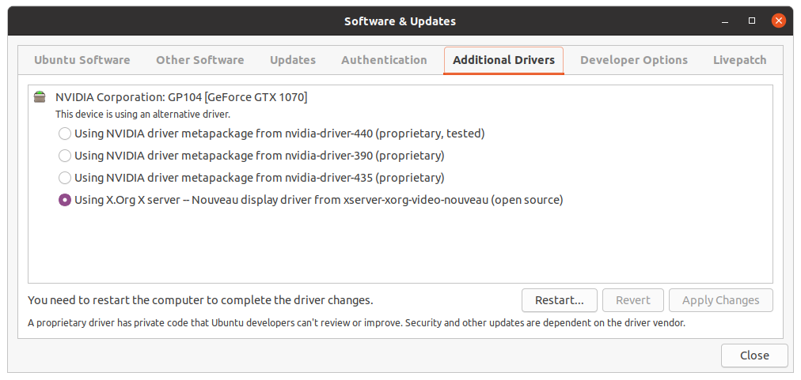

# Setup of TensorFlow GPU, Keras and PyTorch with CUDA, cuDNN and CUPTI using Conda on Ubuntu 18.04 -- the easy way! #

*2018-10-22*

A lot of documents on the web describe the manual installation of CUDA, CuDNN and TensorFlow with GPU support. The problem with the manual installation is that the right versions of NVIDIA driver, CUDA, CuDNN and TensorFlow need to be combined. Thus the manual installation will often fail. But there is a solution: Conda can take care of the installation of the requirements for TensorFlow with GPU support. Conda can install CUDA, CuDNN and the other requirements. However there is one problem left: The NVIDIA driver that comes with Ubuntu 18.04.1 is the version 390. That driver is to old. So we need to install at least the version 396 to be able to set up TensorFlow with Conda. Luckily it is very easy to install that driver. Here are the steps it took me to get TensorFlow and PyTorch to run with GPU support on a freshly installed Ubuntu 18.04.1 desktop machine.

## Backup? ##
I am using a freshly installed Ubuntu 18.04.1 so I don't have the need for a back up. Otherwise I would create a back up of my system before I proceed.

## Install a suitable NVIDIA driver ##
First I want to be sure that my system is up to date:

```
sudo apt update
sudo apt dist-upgrade
sudo reboot now
```

Open *Software & Updates* and select the *Additional Drivers* tab:



The problem is that only the old 390 driver is available as choice. So we need to install later drivers:
```
sudo add-apt-repository ppa:graphics-drivers/ppa
```

Now the later versions of the NVIDIA driver are available:


Select the *nvidia-driver-396* and click *Apply Changes*:


Now I reboot:
```
sudo reboot now
```
To verify that the NVIDIA driver 396 is active I call:
```
nvidia-smi
```
This should result in an output like this:
```
Sun Oct 21 14:10:36 2018       
+-----------------------------------------------------------------------------+
| NVIDIA-SMI 396.54                 Driver Version: 396.54                    |
|-------------------------------+----------------------+----------------------+
| GPU  Name        Persistence-M| Bus-Id        Disp.A | Volatile Uncorr. ECC |
| Fan  Temp  Perf  Pwr:Usage/Cap|         Memory-Usage | GPU-Util  Compute M. |
|===============================+======================+======================|
|   0  GeForce GTX 1070    Off  | 00000000:01:00.0 Off |                  N/A |
|  0%   41C    P0    41W / 151W |    248MiB /  8119MiB |      1%      Default |
+-------------------------------+----------------------+----------------------+
                                                                               
+-----------------------------------------------------------------------------+
| Processes:                                                       GPU Memory |
|  GPU       PID   Type   Process name                             Usage      |
|=============================================================================|
|    0      1909      G   /usr/lib/xorg/Xorg                           160MiB |
|    0      2084      G   /usr/bin/gnome-shell                          85MiB |
+-----------------------------------------------------------------------------+
```
## Install the Anaconda ##

**I proceed as the user that I want to use later to work with TensorFlow and PyTorch. I don't use sudo!** 

I download *Anaconda* from https://www.anaconda.com/download/. The I open a new terminal. 

```
bash Anaconda3-5.3.0-Linux-x86_64.sh 
```

I accept the license terms and confirm the location. I answer *yes* when I am asked if I wish the installer to initialize *Anaconda3* in `.bashrc`. I answer *no* when I am asked if I want to proceed with the installation of *VSCode*.

## Install TensorFlow GPU, Keras and Pytorch with CUDA, cuDNN and CUPTI in a virtual environment ##

**Again: I still use the user that I want to use later to work with TensorFlow and PyTorch. I don't use sudo!** 

Now I reopen the terminal window!

I create a virtual environment. For this example I choose the name *dl* as abbreviation for *Deep Learning*.

```
conda create --name dl
```

I activate the environment!

```
conda activate dl
```

Now I install TensorFlow with GPU support.

```
conda install tensorflow-gpu
```

The package list includes:

```
cudatoolkit:         9.2-0                    
cudnn:               7.2.1-cuda9.2_0          
cupti:               9.2.148-0              
```

Thus there is no need to download these libraries from NVIDIA and install them manually. Conda did the work and conda also took care that the right versions were installed.

I also install PyTorch, see also https://pytorch.org/ :

```
conda install pytorch torchvision cuda92 -c pytorch
```
## Test it! ##

I open a console, activate the environment and start python:
```
conda activate dl
python
```
### Tensorflow ###

I use the test from https://www.tensorflow.org/guide/using_gpu. I enter:
```
import tensorflow as tf
# Creates a graph.
a = tf.constant([1.0, 2.0, 3.0, 4.0, 5.0, 6.0], shape=[2, 3], name='a')
b = tf.constant([1.0, 2.0, 3.0, 4.0, 5.0, 6.0], shape=[3, 2], name='b')
c = tf.matmul(a, b)
# Creates a session with log_device_placement set to True.
sess = tf.Session(config=tf.ConfigProto(log_device_placement=True))
# Runs the op.
print(sess.run(c))
```
The output should contain `device:GPU:0`
```
MatMul: (MatMul): /job:localhost/replica:0/task:0/device:GPU:0
2018-10-21 18:30:00.140665: I tensorflow/core/common_runtime/placer.cc:922] MatMul: (MatMul)/job:localhost/replica:0/task:0/device:GPU:0
a: (Const): /job:localhost/replica:0/task:0/device:GPU:0
2018-10-21 18:30:00.140684: I tensorflow/core/common_runtime/placer.cc:922] a: (Const)/job:localhost/replica:0/task:0/device:GPU:0
b: (Const): /job:localhost/replica:0/task:0/device:GPU:0
2018-10-21 18:30:00.140690: I tensorflow/core/common_runtime/placer.cc:922] b: (Const)/job:localhost/replica:0/task:0/device:GPU:0
[[22. 28.]
 [49. 64.]]
```

I found plausible information regarding the warning "Your CPU supports instructions that this TensorFlow binary was not compiled to use: SSE4.1 SSE4.2 AVX AVX2 FMA" on *Stackoverflow*: https://stackoverflow.com/a/47227886

### PyTorch ###
To test if PyTorch recognizes the GPU I enter the following lines into a python console with active *dl* environment:
```
import torch
torch.cuda.get_device_name(torch.cuda.current_device())
```
The output contains the name of my graphics card:
```
'GeForce GTX 1070'
```

